# Object Detection by Classic Computer Vision Tools 

## Shani Israelov

This is a report describing in details, two pipeline i curated by using classic computer vision tools to solve the next problem: given a video, can we detect a moving object? 
I used as example the next video, and later on i will run other videos as well to see the variations needed and conclude about the strengths and weakness of this methods. 

# First Pipeline: 
### frame extraction

### binary mask and thresholding
Calculate the difference between the first two frames to detect motion, pay attention this cant always be done since the camera can move as well.

lets look at the histogram of frame 1 and the histogram of the difference image. 


for the thresholding we need to use information we have from normal gaussian distribution. Generate a binary mask by thresholding the difference image.
the 68–95–99.7 (empirical) rule says that 95% of the observations are within the range [-2*std, 2*std].


image from wkipedia.

we are leveraging this rule to remove the noise.
```
lower_threshold = mean - 2 * std
upper_threshold = mean + 2 * std
```


### morphological Operation
now that we have a binary mask, we want to be able to distinguish the main object than noise. 
so we want that small objects will disappear, 
for this will use morphological operation, it means
we are doing convulotion of the binary image with a kernel.
in the image from Szeliski Computer vision book (a) original image, (b) dilation , (c) erosion. 
it is worth mentioning that while opening is useful for noise removal, closing is useful for closing smal holes inside foreground object. 


the operation we need for this task is opening, meaning erosion followed by dilation.
the erosion is a kernel that looks at the neighboring of the main pixel, if not all the pixels are 1 (white), than the erosion makes it black. this is the noise removal. 
for pixels that are part of the object they will have neighbhors that are white too. but this operation makes the object thinner, so we return it back to it size by the erosion operation,
the dilation's kernel look at the neighbhors and if there is at least one pixels that is 1 than also the main pixel will be 1 (white).
we Apply erosion with a smaller kernel to minimize shrinking.
Apply dilation with a larger kernel to create a single contour line.
if we scale the kernel it dosn't affect.

```
# Use Morphological Operations to clean noise and fill gaps
kernel = np.ones((3,3), np.uint8) # used smaller kernel for the erosion for minimal shrinking of the foreground
erosion = cv2.erode(binary_mask, kernel, iterations = 1) 
kernel = np.ones((9,9), np.uint8) # used bigger kernel in order to get one contour line
dilation = cv2.dilate(binary_mask, kernel, iterations = 1)
noise_removed = cv2.dilate(erosion, kernel, iterations = 1)
```

in the image we see the binary mask, the erosion result, the dilation result and the rsult of the closing.


### find the contours 


```
contours, hierarchy = cv2.findContours(noise_removed, cv2.RETR_EXTERNAL, cv2.CHAIN_APPROX_NONE) 
print("Number of Contours found = " + str(len(contours))) 
  
# Draw all contours 
# -1 signifies drawing all contours 
cv2.drawContours(frame1_copy, contours, -1, (0, 255, 0), 3) 

x,y,w,h = cv2.boundingRect(contours[0])
cv2.rectangle(frame1_copy2,(x,y),(x+w,y+h),(0,255,0),2)
```

### detect features

Use the Shi-Tomasi Corner Detector to find good features within the bounding box.


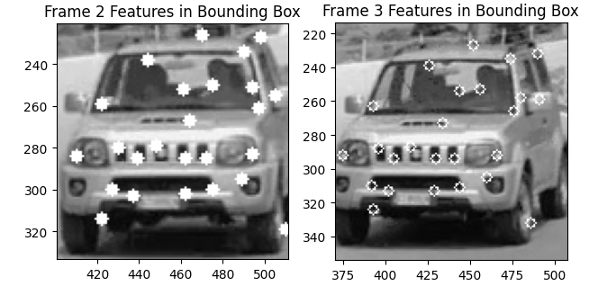

```
# extract good features to track 
# Crop the region of interest (ROI) from the grayscale image
frame2_copy = frame2.copy()
roi = frame2_copy[y:y + h, x:x + w]

# Detect features in the ROI
corners = cv2.goodFeaturesToTrack(roi, 25, 0.01, 10)

if corners is not None:
     # Add bounding box offsets
    corners_global = corners + np.array([x, y], dtype=np.float32)
    for i in corners_global:
        # Adjust corner coordinates relative to the original image
        cx, cy = i.ravel()
        cx, cy = int(cx), int(cy)  # Add bounding box offsets
        #print(f"corner: ({cx}, {cy})")
        
        # Draw the feature point on the original frame
        cv2.circle(frame2_copy, (cx, cy), 3, (255, 0, 0), -1)
else:
    print("no corners have found")
```

### track features
Use Lucas-Kanade Optical Flow to track the detected features in subsequent frames.
Filter only the successfully tracked points (`st == 1`).
we first did on frame 2 and 3 and after successful results we itrerate over all the frames. 

the ouput is:


## Second Pipeline

1. **Extract Frames**
Extracted individual frames from the input video (jeep.gif) and saved them as images (.jpg format). This was done to process frames sequentially in later steps.

2. **Keypoint Detection with SIFT:**

   - Detected keypoints in the first two frames (frame1 and frame2) using the SIFT algorithm.
   - Keypoints are distinctive points in the image, useful for tracking and alignment.
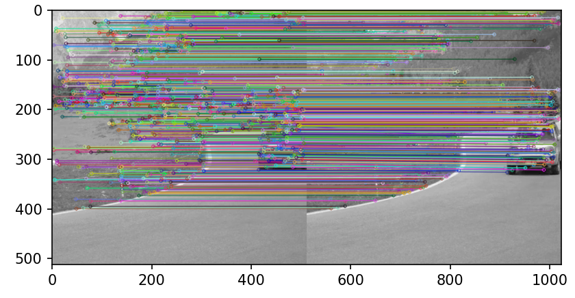

 3. **Feature Matching:**

   - Matched the detected keypoints between the two frames using Brute-Force Matcher (BFMatcher).
   - Applied a ratio test to filter matches, retaining only those where the closest match was significantly better than the second closest.
   - Homography Estimation with RANSAC
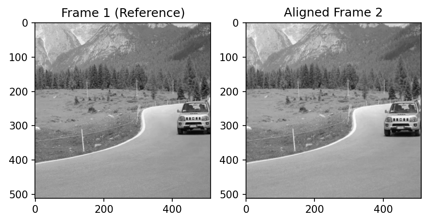

   - 
   - Extracted the matched keypoints into source (src_pts) and destination (dst_pts) arrays.
   - Used RANSAC to estimate a homography matrix that maps points in frame1 to frame2:
   - RANSAC robustly filtered outliers by iteratively fitting models to random subsets of points and choosing the best model.
   - Visualized the inliers and outliers on frame1 to verify the moving object regions.
   - 
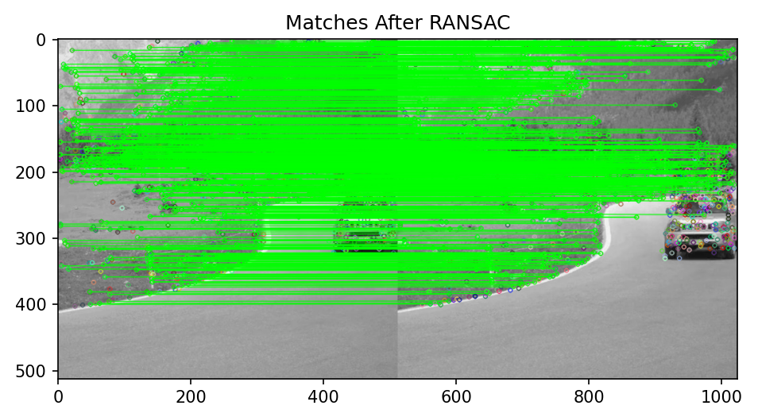

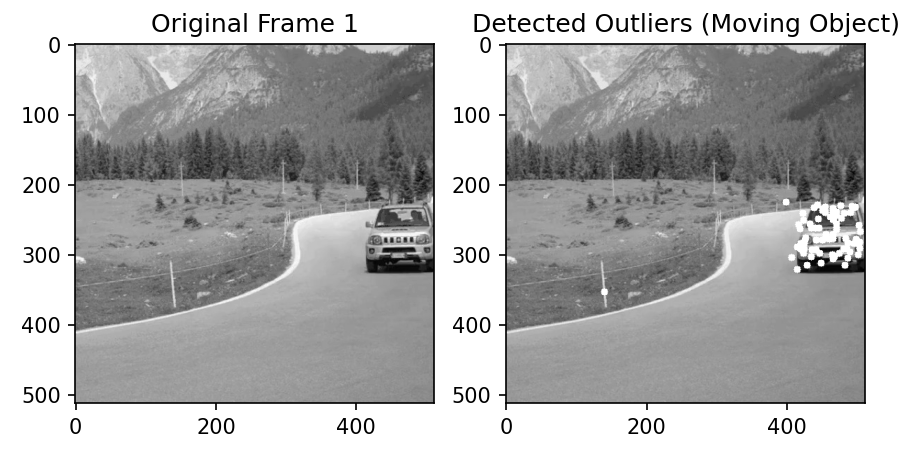

 4. **Cluster Outlier Points**
 
   - Clustered the outliers (likely belonging to the moving object) into two groups using K-Means:
   - Clustering was performed both with and without intensity as a feature.
   - Selected the largest cluster to focus on the main moving object.
     
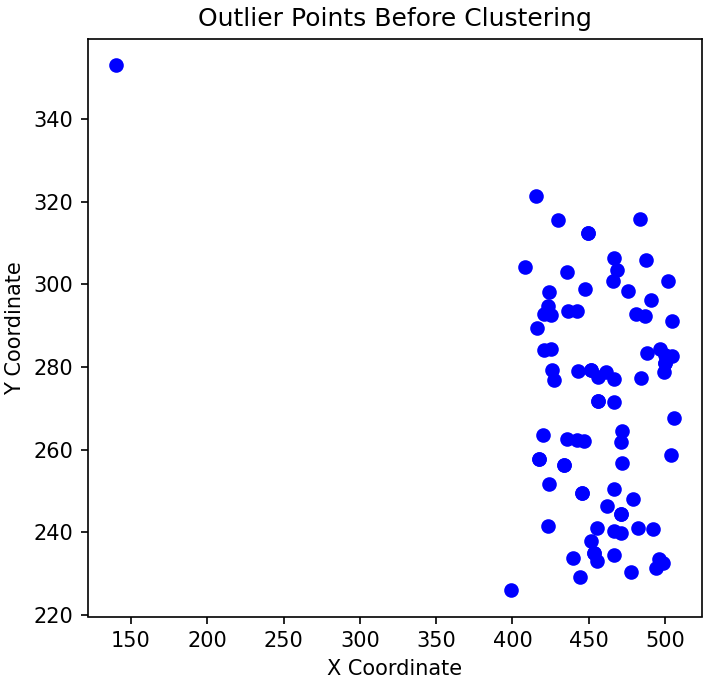

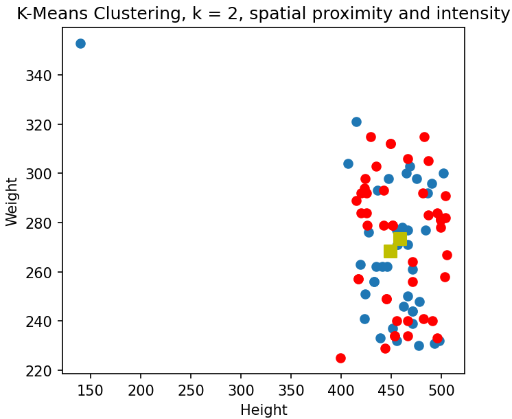

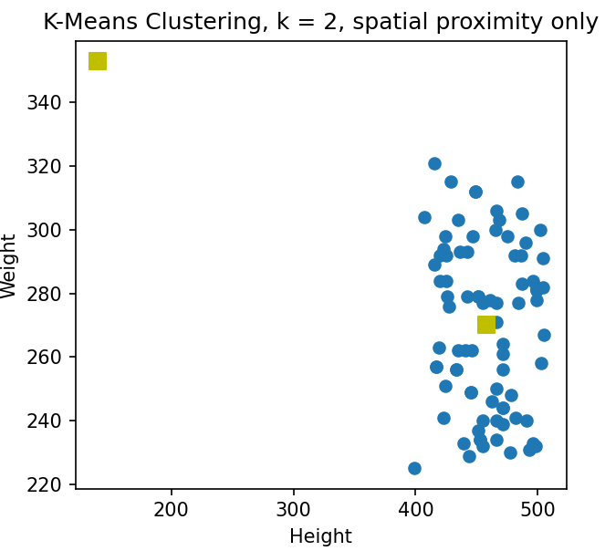

5. **Bounding Box for the Main Cluster**
   
   - Calculated the bounding box around the largest cluster of outlier points:
   - Used the mean and distances of the cluster points to filter stray points and tighten the bounding box.
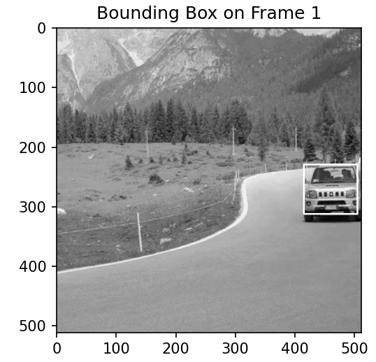

7. **ROI Histogram Creation**
   
   - Extracted the Region of Interest (ROI) corresponding to the bounding box.
   - Converted the ROI from grayscale to the HSV color space.
   - Calculated and normalized the hue channel histogram of the ROI:
   - Normalization ensured robustness against illumination changes.
     
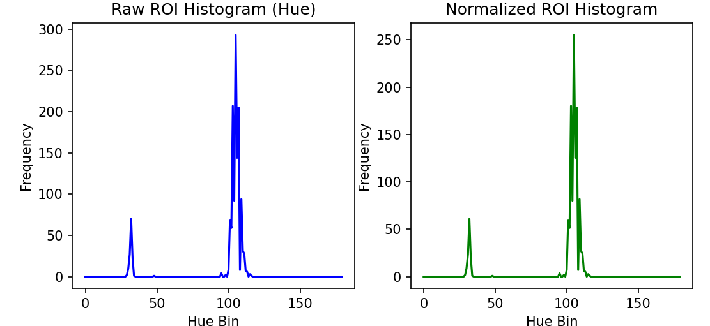

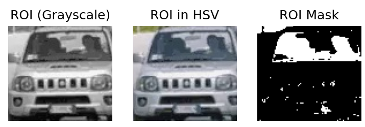

7. **Tracking with MeanShift**
   - Used the histogram from the previous step to create a back-projection map for each frame:
   - Bright regions in the map correspond to areas similar to the object's histogram.
   - Applied MeanShift tracking to locate the bounding box of the object in subsequent frames.
   - Saved both the tracking output and the back-projection map as videos for evaluation.

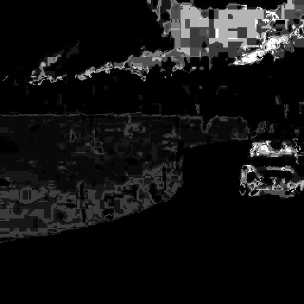


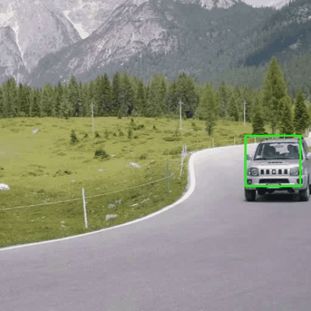
