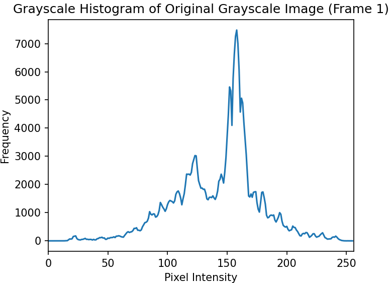
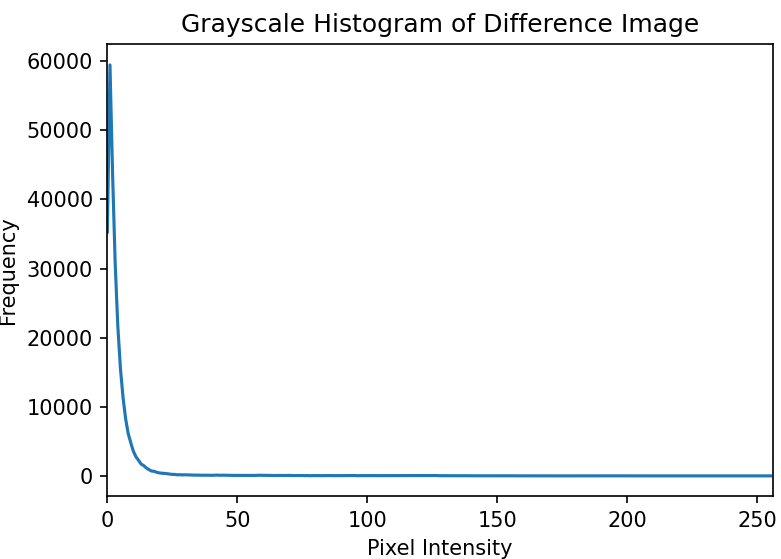
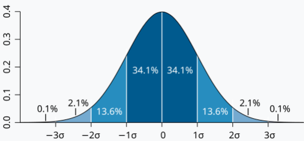
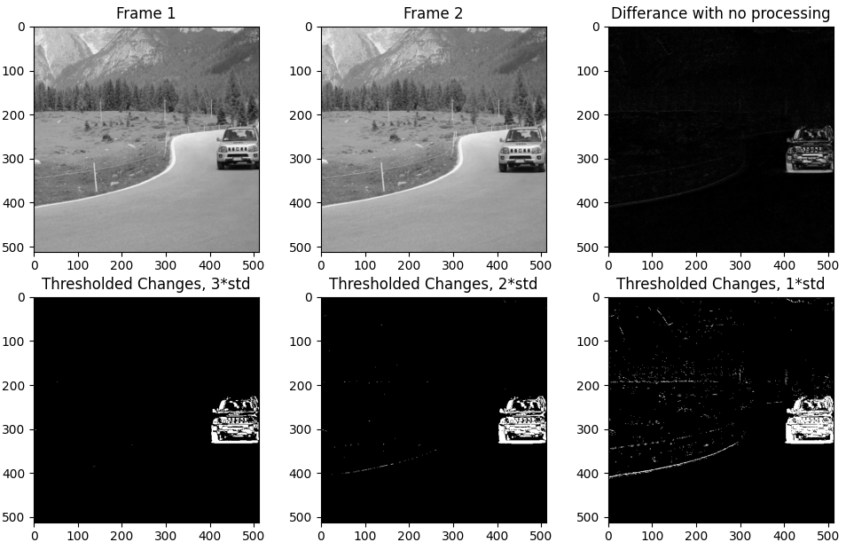
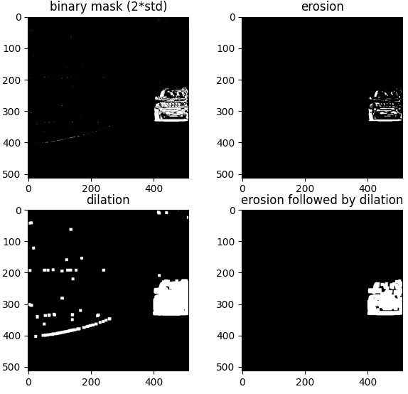
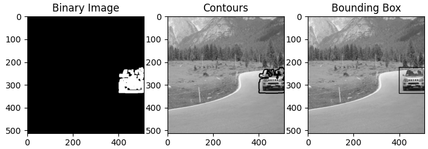
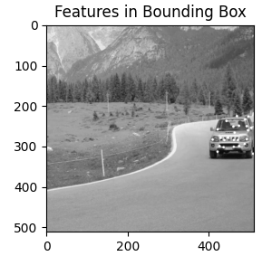
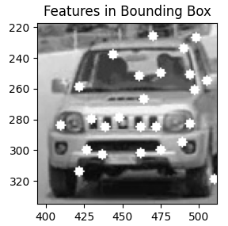
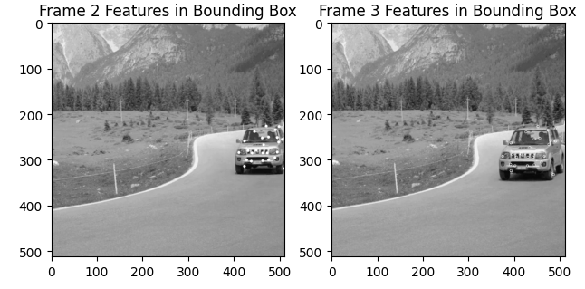
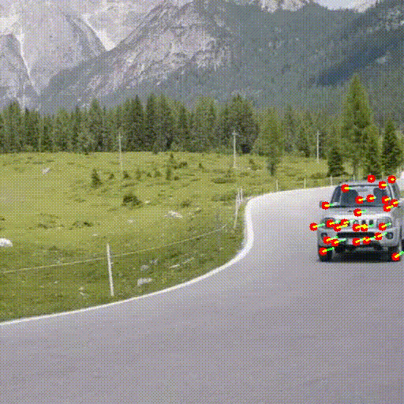

# Object Detection by Classic Computer Vision Tools 

## Shani Israelov

# This is a report describing in details, two pipeline i curated by using classic computer vision tools to solve the next problem: given a video, can we detect a moving object? 
I used as example the next video, and later on i will run other videos as well to see the variations needed and conclude about the strengths and weakness of this methods. 

# first pipeline: 
frame extraction

### binary mask and thresholding
Calculate the difference between the first two frames to detect motion, pay attention this cant always be done since the camera can move as well.

lets look at the histogram of frame 1 and the histogram of the difference image. 




for the thresholding we need to use information we have from normal gaussian distribution. Generate a binary mask by thresholding the difference image.
the 68–95–99.7 (empirical) rule says that 95% of the observations are within the range [-2*std, 2*std].


image from wkipedia.

we are leveraging this rule to remove the noise.
```
lower_threshold = mean - 2 * std
upper_threshold = mean + 2 * std
```




### morphological Operation
now that we have a binary mask, we want to be able to distinguish the main object than noise. 
so we want that small objects will disappear, 
for this will use morphological operation, it means
we are doing convulotion of the binary image with a kernel.
in the image from Szeliski Computer vision book (a) original image, (b) dilation , (c) erosion. 
it is worth mentioning that while opening is useful for noise removal, closing is useful for closing smal holes inside foreground object. 


the operation we need for this task is opening, meaning erosion followed by dilation.
the erosion is a kernel that looks at the neighboring of the main pixel, if not all the pixels are 1 (white), than the erosion makes it black. this is the noise removal. 
for pixels that are part of the object they will have neighbhors that are white too. but this operation makes the object thinner, so we return it back to it size by the erosion operation,
the dilation's kernel look at the neighbhors and if there is at least one pixels that is 1 than also the main pixel will be 1 (white).
we Apply erosion with a smaller kernel to minimize shrinking.
Apply dilation with a larger kernel to create a single contour line.
if we scale the kernel it dosn't affect.

```
# Use Morphological Operations to clean noise and fill gaps
kernel = np.ones((3,3), np.uint8) # used smaller kernel for the erosion for minimal shrinking of the foreground
erosion = cv2.erode(binary_mask, kernel, iterations = 1) 
kernel = np.ones((9,9), np.uint8) # used bigger kernel in order to get one contour line
dilation = cv2.dilate(binary_mask, kernel, iterations = 1)
noise_removed = cv2.dilate(erosion, kernel, iterations = 1)
```

in the image we see the binary mask, the erosion result, the dilation result and the rsult of the closing.


### find the contours 



### detect features
Use the Shi-Tomasi Corner Detector to find good features within the bounding box.





 
### track features
Use Lucas-Kanade Optical Flow to track the detected features in subsequent frames.
Filter only the successfully tracked points (`st == 1`).

the ouput is:


