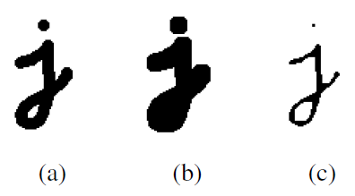

# Object Detection by Classic Computer Vision Tools 

## Shani Israelov

This is a report describing in details, two pipeline i curated by using classic computer vision tools to solve the next problem: given a video, can we detect a moving object? 
I used as example the next video, and later on i will run other videos as well to see the variations needed and conclude about the strengths and weakness of this methods. 

# First Pipeline: 
### frame extraction

### binary mask and thresholding
Calculate the difference between the first two frames to detect motion, pay attention this cant always be done since the camera can move as well.

lets look at the histogram of frame 1 and the histogram of the difference image. 


for the thresholding we need to use information we have from normal gaussian distribution. Generate a binary mask by thresholding the difference image.
the 68–95–99.7 (empirical) rule says that 95% of the observations are within the range [-2*std, 2*std].


image from wkipedia.

we are leveraging this rule to remove the noise.
```
lower_threshold = mean - 2 * std
upper_threshold = mean + 2 * std
```


### morphological Operation
now that we have a binary mask, we want to be able to distinguish the main object than noise. 
so we want that small objects will disappear, 
for this will use morphological operation, it means
we are doing convulotion of the binary image with a kernel.
in the image from Szeliski Computer vision book (a) original image, (b) dilation , (c) erosion. 
it is worth mentioning that while opening is useful for noise removal, closing is useful for closing smal holes inside foreground object. 



the operation we need for this task is opening, meaning erosion followed by dilation.
the erosion is a kernel that looks at the neighboring of the main pixel, if not all the pixels are 1 (white), than the erosion makes it black. this is the noise removal. 
for pixels that are part of the object they will have neighbhors that are white too. but this operation makes the object thinner, so we return it back to it size by the erosion operation,
the dilation's kernel look at the neighbhors and if there is at least one pixels that is 1 than also the main pixel will be 1 (white).
we Apply erosion with a smaller kernel to minimize shrinking.
Apply dilation with a larger kernel to create a single contour line.
if we scale the kernel it dosn't affect.

```
# Use Morphological Operations to clean noise and fill gaps
kernel = np.ones((3,3), np.uint8) # used smaller kernel for the erosion for minimal shrinking of the foreground
erosion = cv2.erode(binary_mask, kernel, iterations = 1) 
kernel = np.ones((9,9), np.uint8) # used bigger kernel in order to get one contour line
dilation = cv2.dilate(binary_mask, kernel, iterations = 1)
noise_removed = cv2.dilate(erosion, kernel, iterations = 1)
```

in the image we see the binary mask, the erosion result, the dilation result and the rsult of the closing.


### find the contours 


```
contours, hierarchy = cv2.findContours(noise_removed, cv2.RETR_EXTERNAL, cv2.CHAIN_APPROX_NONE) 
print("Number of Contours found = " + str(len(contours))) 
  
# Draw all contours 
# -1 signifies drawing all contours 
cv2.drawContours(frame1_copy, contours, -1, (0, 255, 0), 3) 

x,y,w,h = cv2.boundingRect(contours[0])
cv2.rectangle(frame1_copy2,(x,y),(x+w,y+h),(0,255,0),2)
```

### detect features

Use the Shi-Tomasi Corner Detector to find good features within the bounding box.


```
# extract good features to track 
# Crop the region of interest (ROI) from the grayscale image
frame2_copy = frame2.copy()
roi = frame2_copy[y:y + h, x:x + w]

# Detect features in the ROI
corners = cv2.goodFeaturesToTrack(roi, 25, 0.01, 10)

if corners is not None:
     # Add bounding box offsets
    corners_global = corners + np.array([x, y], dtype=np.float32)
    for i in corners_global:
        # Adjust corner coordinates relative to the original image
        cx, cy = i.ravel()
        cx, cy = int(cx), int(cy)  # Add bounding box offsets
        #print(f"corner: ({cx}, {cy})")
        
        # Draw the feature point on the original frame
        cv2.circle(frame2_copy, (cx, cy), 3, (255, 0, 0), -1)
else:
    print("no corners have found")
```

### track features
Use Lucas-Kanade Optical Flow to track the detected features in subsequent frames.
Filter only the successfully tracked points (`st == 1`).
we first did on frame 2 and 3 and after successful results we itrerate over all the frames. 

the ouput is:


## Second Pipeline

1. **Extract Frames**
Extracted individual frames from the input video (jeep.gif) and saved them as images (.jpg format). This was done to process frames sequentially in later steps.

2. **Keypoint Detection with SIFT:**

   - Detected keypoints in the first two frames (frame1 and frame2) using the SIFT algorithm.
   - Keypoints are distinctive points in the image, useful for tracking and alignment.
     


```
# Load two grayscale frames
frame1 = cv2.imread(frame1_path, cv2.IMREAD_GRAYSCALE)
frame2 = cv2.imread(frame2_path, cv2.IMREAD_GRAYSCALE)

sift = cv2.SIFT_create()
kp1, des1 = sift.detectAndCompute(frame1,None)
kp2, des2 = sift.detectAndCompute(frame2,None)
```

 3. **Feature Matching:**

   - Matched the detected keypoints between the two frames using Brute-Force Matcher (BFMatcher).
```
# BFMatcher with default params
bf = cv2.BFMatcher()
matches = bf.knnMatch(des1,des2,k=2)
 
# Apply ratio test
good_matches = []
good_matches_sublist = []
for m,n in matches:
    if m.distance < 0.75*n.distance:
        good_matches_sublist.append([m])
        good_matches.append(m)

# cv.drawMatchesKnn expects list of lists as matches.
img3 = cv2.drawMatchesKnn(frame1,kp1,frame2,kp2,good_matches_sublist,None,flags=cv2.DrawMatchesFlags_NOT_DRAW_SINGLE_POINTS)

```

* note: add explanation how brute force matcher is implemented.
  
   - Applied a ratio test to filter matches, retaining only those where the closest match was significantly better than the second closest.
   - Homography Estimation with RANSAC
     
```
 # Extract locations of matched keypoints
src_pts = np.float32([kp1[m.queryIdx].pt for m in good_matches]).reshape(-1, 1, 2) 
dst_pts = np.float32([kp2[m.trainIdx].pt for m in good_matches]).reshape(-1, 1, 2)

# Use RANSAC to estimate the homography matrix and filter outliers
H, mask = cv2.findHomography(src_pts, dst_pts, cv2.RANSAC, 5.0) # src for frame1 keypoints, dst for frame2 keypoints
matches_mask = mask.ravel().tolist()

# Draw inliers
draw_params = dict(matchColor=(0, 255, 0),  # Green matches
                   singlePointColor=None,
                   matchesMask=matches_mask,  # Draw only inliers
                   flags=cv2.DrawMatchesFlags_DEFAULT)

img4 = cv2.drawMatches(frame1, kp1, frame2, kp2, good_matches, None, **draw_params)
```

```
# Warp frame2 to align with frame1
height, width = frame1.shape
aligned_frame2 = cv2.warpPerspective(frame2, H, (width, height))
```


   - Extracted the matched keypoints into source (src_pts) and destination (dst_pts) arrays.

```
    # Extract inliers and outliers from RANSAC
inliers = np.where(mask.ravel() == 1)[0]
outliers = np.where(mask.ravel() == 0)[0]

# Separate inlier and outlier points
inlier_src_pts = src_pts[inliers] # src for frame1 keypoints, dst for frame2 keypoints
inlier_dst_pts = dst_pts[inliers]

outlier_src_pts = src_pts[outliers]
outlier_dst_pts = dst_pts[outliers]

# Visualize outliers (moving object points) on frame1
frame1_outliers = frame1.copy()
for pt in outlier_src_pts: # outlier_src_pts in frame1
    x, y = int(pt[0][0]), int(pt[0][1])
    cv2.circle(frame1_outliers, (x, y), 5, (255, 0, 0), -1)  # Red circles for outliers

```
   - Used RANSAC to estimate a homography matrix that maps points in frame1 to frame2:
   - RANSAC robustly filtered outliers by iteratively fitting models to random subsets of points and choosing the best model.
   - Visualized the inliers and outliers on frame1 to verify the moving object regions.
   - 


 4. **Cluster Outlier Points**
 
   - Clustered the outliers (likely belonging to the moving object) into two groups using K-Means:
   - Clustering was performed both with and without intensity as a feature.
   - Selected the largest cluster to focus on the main moving object.
```
# clustering that doesn't includes the intensity, better for this
z = []
for pt in outlier_src_pts: # outlier_src_pts in frame1
    x, y = int(pt[0][0]), int(pt[0][1]) # we can cluster based on spatial proximity.
    z.append([x, y])

# convert to np.float32
Z = np.float32(z)
# define criteria and apply kmeans()
criteria = (cv2.TERM_CRITERIA_EPS + cv2.TERM_CRITERIA_MAX_ITER, 10, 1.0) # when to stop, num of iterations, epsilon (the desired accuracy)
ret,label,center=cv2.kmeans(Z,k,None,criteria,10,cv2.KMEANS_RANDOM_CENTERS)
# Now separate the data, Note the flatten()
A = Z[label.ravel()==0]
B = Z[label.ravel()==1]

# lets track only the biggest cluster points
# Identify the cluster with the most points
object_cluster = A if A.shape[0] > B.shape[0] else B
```


5. **Bounding Box for the Main Cluster**
   
   - Calculated the bounding box around the largest cluster of outlier points:
   - Used the mean and distances of the cluster points to filter stray points and tighten the bounding box.
```
# Find the bounding box for the selected cluster
# Compute distances from the cluster centroid
distances = np.linalg.norm(object_cluster - np.mean(object_cluster, axis=0), axis=1)
threshold = np.percentile(distances, 90)  # Adjust this threshold as needed
filtered_points = object_cluster[distances <= threshold]

# Calculate the bounding box using filtered points
x_min, y_min = np.min(filtered_points, axis=0)
x_max, y_max = np.max(filtered_points, axis=0)
bounding_box = (int(x_min), int(y_min), int(x_max - x_min), int(y_max - y_min))
x, y, w, h = bounding_box
print(f"Bounding box: x={x}, y={y}, w={w}, h={h}")
if x < 0 or y < 0 or x+w > frame1.shape[1] or y+h > frame1.shape[0]:
    print("Error: Bounding box is out of frame bounds")
```


7. **ROI Histogram Creation**
   
   - Extracted the Region of Interest (ROI) corresponding to the bounding box.
   - Converted the ROI from grayscale to the HSV color space.
   - Calculated and normalized the hue channel histogram of the ROI:
   - Normalization ensured robustness against illumination changes.
     


```
# Set up the ROI for tracking
# Visualize the ROI in the original frame
roi = frame1[y:y+h, x:x+w]
# Convert ROI to HSV
frame1_bgr = cv2.imread(frame1_path)
frame1_hsv = cv2.cvtColor(frame1_bgr, cv2.COLOR_BGR2HSV)
roi_hsv = frame1_hsv[y:y+h, x:x+w]
# Visualize the mask applied to the HSV ROI
mask = cv2.inRange(roi_hsv, np.array((0., 50., 50.)), np.array((180., 255., 255.)))
# Calculate and plot the ROI histogram
roi_hist = cv2.calcHist([roi_hsv], [0], mask, [180], [0, 180])
# Normalize the histogram and visualize
cv2.normalize(roi_hist, roi_hist, 0, 255, cv2.NORM_MINMAX)
```

7. **Tracking with MeanShift**
   - Used the histogram from the previous step to create a back-projection map for each frame:
   - Bright regions in the map correspond to areas similar to the object's histogram.
   - 
  
  
```
# Setup the termination criteria for MeanShift
term_crit = (cv2.TERM_CRITERIA_EPS | cv2.TERM_CRITERIA_COUNT, 10, 1)

# Iterate through all frames in sorted order# Process each frame
for frame_path in frame_paths[1:]:
    curr_frame = cv2.imread(frame_path)
    hsv = cv2.cvtColor(curr_frame, cv2.COLOR_BGR2HSV)
    dst = cv2.calcBackProject([hsv], [0], roi_hist, [0, 180], 1)
    cv2.imshow("Back-Projection", dst)
    # Debug: Save dst to video
    dst_colorized = cv2.applyColorMap(cv2.convertScaleAbs(dst, alpha=255.0/dst.max()), cv2.COLORMAP_JET)  # Optional for visualization
    # Debug: Visualize and save the back-projection
    cv2.imshow("Back-Projection", dst)
    out_dst.write(dst)  # Write the grayscale back-projection directly

    # Apply MeanShift
    ret, track_window = cv2.meanShift(dst, track_window, term_crit)
    print(f"Updated track_window: {track_window}")

    # Draw the rectangle
    x, y, w, h = track_window
    tracked_frame = cv2.rectangle(curr_frame, (x, y), (x + w, y + h), (0, 255, 0), 2)

    # Optional: Visualize the tracking result
    # Write the frame to the output video
    out.write(tracked_frame)
```

   - Applied MeanShift tracking to locate the bounding box of the object in subsequent frames.
   - Saved both the tracking output and the back-projection map as videos for evaluation.


